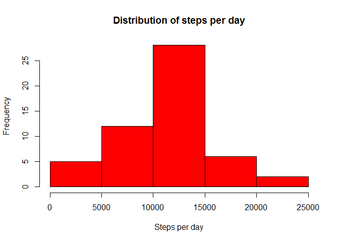
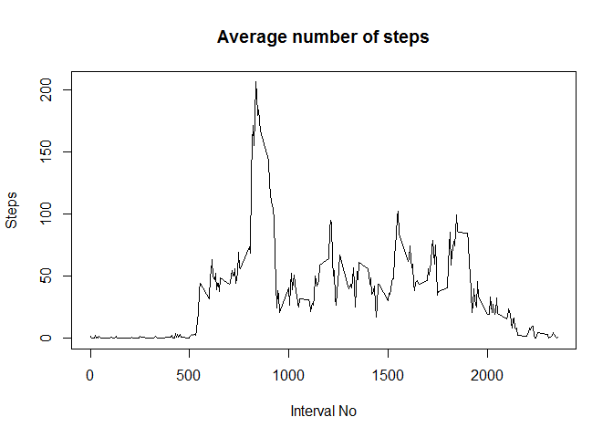
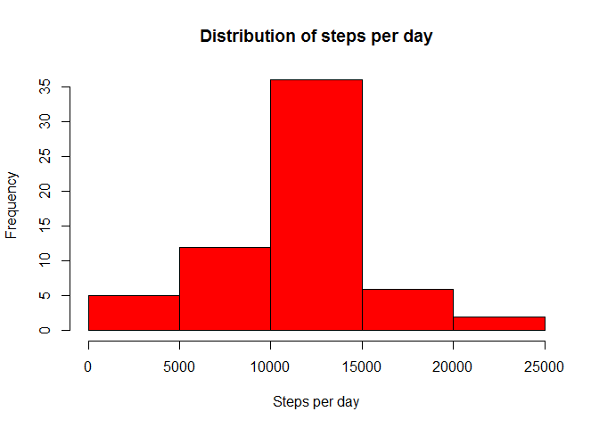

# Reproducible Research: Peer Assessment 1


## Loading and preprocessing the data
Load data from zip archive:

```r
data <- read.csv(unz("activity.zip", "activity.csv"), header = TRUE, sep = ",", na.strings = "NA")
data <- transform(data, date = as.Date(date, "%Y-%m-%d"))
activity <- na.omit(data)

#disable scientific notation
options(scipen=999)
```

## What is mean total number of steps taken per day?

```r
stepsPerDay <- aggregate(steps ~ date, activity, sum)$steps
hist(stepsPerDay, main = "Distribution of steps per day", xlab = "Steps per day", col = "red")
```

 

```r
meanStepNo = mean(stepsPerDay)
medianStepNo = median(stepsPerDay)
```

The __mean__ steps number per day is _10766.1886792_, __median__ is _10765_

## What is the average daily activity pattern?

```r
stepsPerInt <- aggregate(steps ~ interval, activity, mean)
plot(stepsPerInt,
     type = "l", main = "Average number of steps",
     xlab = "Interval No", ylab = "Steps")
```

 

```r
maxStepsInt <- stepsPerInt[which.max(stepsPerInt$steps), ]
```

Maximum number of steps is _206.1698113_ in the interval _835_

## Imputing missing values

```r
naIndices = which(is.na(data$steps))
numOfNa = length(naIndices)
```

Number of missing values is _2304_


```r
activityFilled <- data
for(index in naIndices){
    interval <- activityFilled[index, ]$interval
    activityFilled[index, ]$steps <- stepsPerInt[stepsPerInt$interval == interval, ]$steps
}

stepsPerDayFilled <- aggregate(steps ~ date, activityFilled, sum)$steps
hist(stepsPerDayFilled, main = "Distribution of steps per day", xlab = "Steps per day", col = "red")
```

 

```r
meanStepNoFilled = mean(stepsPerDayFilled)
medianStepNoFilled = median(stepsPerDayFilled)
```

The __mean__ steps number per day is _10766.1886792_, __median__ is _10766.1886792_

## Are there differences in activity patterns between weekdays and weekends?

```r
require(lattice)
```

```
## Loading required package: lattice
```

```r
dayType <- weekdays(activityFilled$date) %in% c("Sunday", "Saturday")
activityFilled$dayType  <- factor(dayType, labels = c("weekday", "weekend"))

stepsPerDayType <- aggregate(steps ~ interval + dayType, activityFilled, mean)
xyplot(steps ~ interval | dayType, layout = c(1, 2), data = stepsPerDayType, type = "l")
```

 
